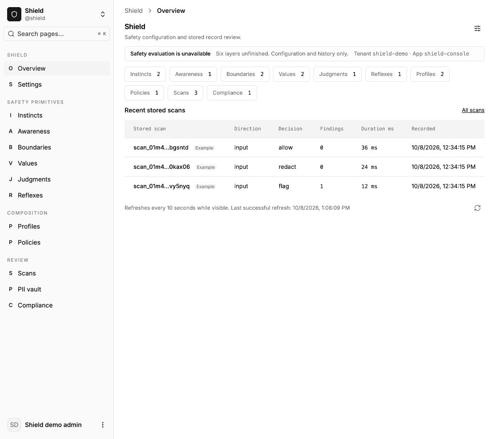
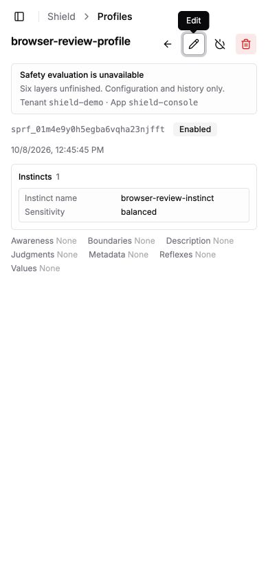
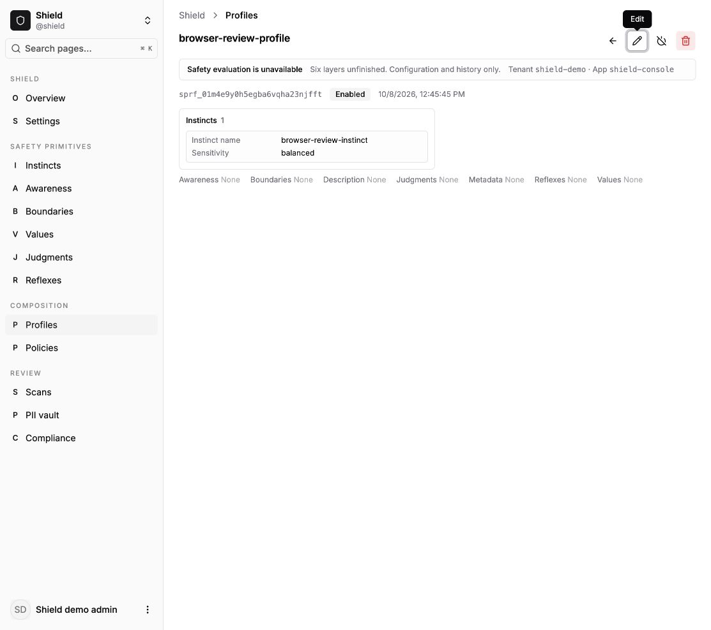
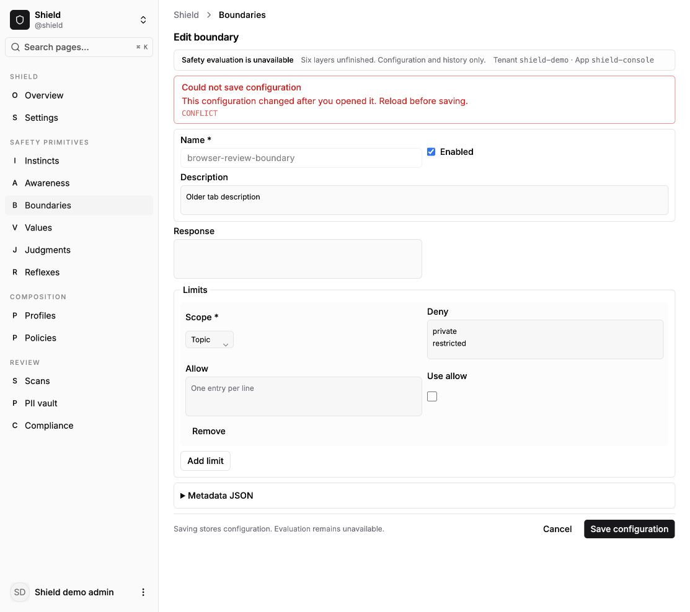
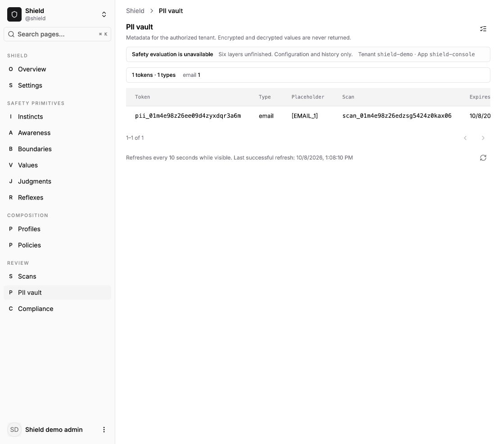
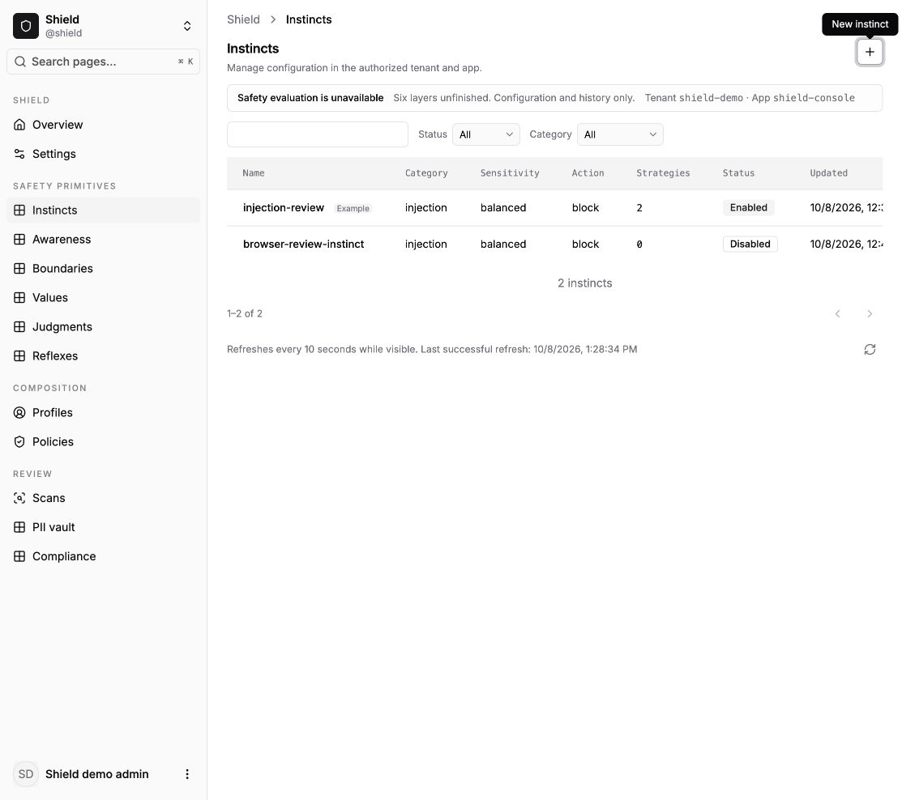

# Shield dashboard migration review

Shield administration runs in the React dashboard with 39 routes and 67 contract
intents. The six evaluation layers remain unavailable. Configuration saves,
recorded decisions and example reports do not establish protection or compliance.

## Implementation

- Eight editable collections: instincts, awareness, boundaries, values,
  judgments, reflexes, profiles and policies. Structured forms preserve false,
  zero and cleared arrays; JSON configuration uses a lazy CodeMirror editor.
- Tenant/app scope is resolved from authenticated identity. Payload scope cannot
  authorize access. Manage and sensitive privacy rights are checked server-side.
- SQLite, PostgreSQL and MongoDB use scoped predicates, database counts, stable
  ordering and bounded reference queries. Policy assignment reads reflect storage.
- Scan and report review preserve historical fields. PII reads return metadata,
  never ciphertext or decrypted content. Retention uses a fixed five-minute
  preview, at most 100 IDs, a fixed cutoff and synchronous audit records.
- Contextual actions use the shared kit IconButton, 32px controls with tooltips and accessible
  names. Keyboard focus shows tooltips. Save and confirmation actions retain text.
- Runtime settings are read-only. The old 95-file templ dashboard is retired after
  a sibling source audit found no external consumers. The inventory remains in
  Shield's MIGRATION.md.

## Verified

| Check | Evidence |
| --- | --- |
| Shield Go suite and build | `GOWORK=off go test ./...` and `go build ./...` pass after retirement. |
| All database backends | Shared conformance passes with live PostgreSQL 17 and MongoDB, plus SQLite. Unique test databases are dropped. All six reference kinds are checked. |
| Service and real transport | Foreign IDs, missing/malformed claims, denied/manage permissions, CSRF refusal, replay, zero/clear updates, references and audited bounded retention pass. |
| React plugin | 18 tests, TypeScript and ESLint pass. Tests include interrupted save retry keys, duplicate submissions, paging reset, read-only access, in-dialog errors and retention cancel/retry. |
| Shared kit | 176 tests and TypeScript pass with compact headers/tables. |
| Real Go demo | 117 HTTP requests pass across all eight CRUD workflows, assignments and record/privacy reads. Persistent SQLite seed/restart test passes. |
| Synthetic fixture | All 67 manifest intents exercised over HTTP, including mutable reads and replay. Not live acceptance. |
| Browser, real Go backend | Created a disabled instinct with a zero strategy weight, cleared its array, created a referencing profile, assigned/unassigned a policy, reviewed/cancelled retention. Data remained after process restart. Multiline boundary typing and a rejected stale save from a second tab also pass. |
| Compact layout | Heading is 16px with 24px line height. Details use inline scalar metadata, compact structured sections and summarized empty fields. A 390px viewport has 390px body width. |
| Production bundling | Vite production build passes. Shield editor and CodeMirror remain outside the entry's static import closure. Measured sizes are in BASELINE.md. |

## Final review

A fresh read-only reviewer reported three Important findings and no Critical
findings. All three were fixed. Multiline list controls retain the textarea
text while parsing entries; edit commands send only changed fields and the
original revision, with an atomic revision predicate in all three stores;
PII type totals use tenant-scoped database aggregates independent of paging.

The regression tests failed before their fixes. The final Shield Go suite and
build, live three-backend conformance, 18 React tests, TypeScript and ESLint all
pass. The real demo's Go suite passes. A second browser tab disabled a boundary;
the older editor then received a visible CONFLICT and did not restore it.
No Minor findings were reported or deferred.

Backend: Shield `df81546`, dashboard icon/editor fixes `6d70181`, main. Browser URLs:
`http://127.0.0.1:5201/@shield`,
`http://127.0.0.1:5201/@shield/profiles/sprf_01m4e9y0h5egba6vqha23njfft`,
`http://127.0.0.1:5201/@shield/pii` and the run-owned boundary editor.
Desktop viewport: 1113x988. Narrow viewport: 390x844, body width 390.
The reader demo hid edit/delete controls. A stopped backend produced a visible
transport failure, and polling recovered after restart. A UI regression test
keeps the last successful refresh time visible after failures.

## Remaining qualification limits

The full dashboard workspace test run is not green: eight failures in concurrent
`packages/host/test/setup-screen.test.tsx` failed the first run. A later no-bail run completed with the same eight host failures. Shield now passes its final 18 tests. The ordinary shell build has two concurrent errors
in `apps/shell/src/design-preview/DashboardPreview.tsx`: removed `scopes` prop at
line 878 and an implicit-any parameter at 885. Those files are outside Shield
ownership and were preserved. The separate Vite build verifies bundling, not
that the ordinary TypeScript build passes.

Browser confirmation of permanent PII deletion was not clicked. Isolated
service/transport tests verify execution, audit failure, retries and scope
binding; the real HTTP acceptance removes only its own configuration rows.
The browser review covered representative workflows and layouts, not every one of the 39 routes at both widths. Cache isolation and denied writes were tested through contracts and shared query behavior, not a production tenant-switch journey.
No production identity provider, deployment, evaluator, report generator or
third-party templ plugin was qualified by this migration.

## Decisions

- Work stays on main in primary checkouts. Shared files are reconciled with the
  Ctrlplane/Cortex chats and committed with exact paths; nothing is pushed.
- App/name uniqueness remains unchanged. Different tenants in the same app can
  still conflict on names; changing it needs a data migration.
- Retention preview is a command because it creates a server-held selection.
  It uses the CSRF handshake even though preview itself deletes nothing.
- Organization policy/report scope requires a trusted host resolver override.
  Arbitrary organization keys from payloads cannot change authorization.
- Manifest input schemas and editor field descriptors come from the same Go
  definitions. Static YAML alone does not include the enriched schemas.
- Compact selectors override older unlayered typography rules and make shared
  tables denser. Existing theme colors and focus treatments are retained.
- Legacy code was preserved until runtime and browser parity were verified.
  Unowned workspace failures are reported separately from passing Shield checks.

## Shared icon control follow-up

Shield now delegates its icon actions to the kit's IconButton from `140209c`.
Navigation keeps a thin PluginLink adapter with an explicit icon child, because
PluginLink requires children and an empty child suppresses the rendered glyph.
All 18 Shield tests, TypeScript and ESLint pass. Browser review confirms the
New instinct link contains its icon and shows a tooltip on keyboard focus.
The development shell was restarted after the concurrent Nexus dependency
update left Vite's resolution cache stale; the Shield page recovered.

